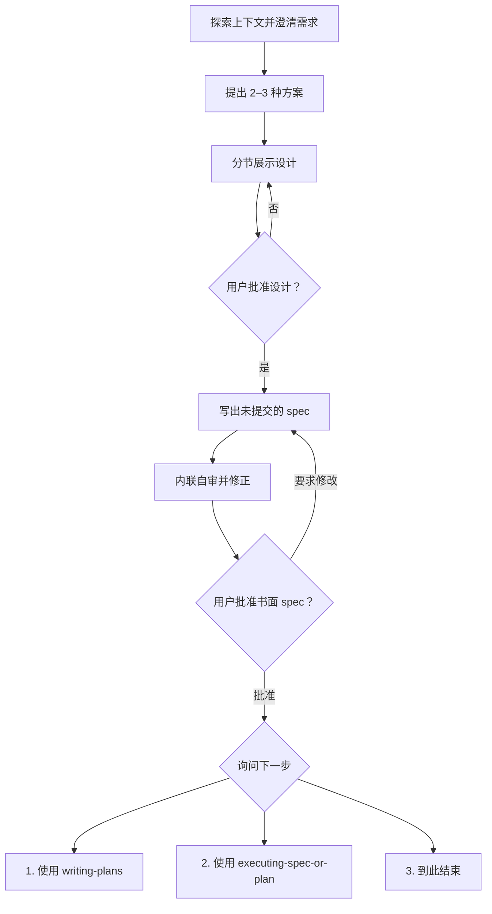

# 将想法头脑风暴为设计

## 概述

通过自然的协作对话，把一个尚未明确的可实施项目或变更整理成经过用户批准的规格说明书（spec）。

## 激活边界

只有以下情况构成显式调用：

- 用户直接要求使用 `brainstorming`。
- 用户明确选择一个写有“使用 `brainstorming`”的编号或选项。

否定使用、询问技能功能、仅说“继续”“开始吧”，或任务内容恰好适合头脑风暴，都不构成调用。未被显式调用时，不应用本技能的流程或硬门。

<HARD-GATE>
本技能一旦被显式调用，在设计和书面 spec 获得用户批准前，不得编写实现代码、搭建项目脚手架或采取实施行动。

用户可以随时明确取消 brainstorming。取消后立即结束本技能，不自动调用其他技能。
</HARD-GATE>

## 工作流程

按顺序完成：

1. **探索项目上下文**——检查相关文件、文档和近期变更。
2. **评估范围**——识别是否包含多个应分别设计的独立子项目。
3. **提出澄清问题**——每次只问一个，了解目的、约束和成功标准。
4. **提出 2–3 种方案**——说明取舍，先给出建议及理由。
5. **分节展示设计**——按复杂度调整篇幅，每节后获得用户确认。
6. **编写 spec**——保存到 `docs/superpowers/specs/YYYY-MM-DD-<topic>-design.md`。
7. **内联自审**——修复占位符、矛盾、歧义和范围问题。
8. **用户审阅**——用户可反复要求修改，直到明确批准。
9. **询问批准后的操作**——只提供本文规定的三个选项。



## 理解想法

- 先了解现有项目状态，再提出方案。
- 请求若覆盖多个独立子系统，先帮助用户拆分；每个子项目分别进行 spec → plan/implementation 循环。
- 对范围合适的项目，每条消息只问一个问题；需要深入时拆成连续问题。
- 优先理解目的、约束、成功标准和明确不做的内容。
- 简单项目可以使用很短的设计和 spec，但不能跳过批准。

## 探索方案

- 提出 2–3 种真正不同的方案及其取舍。
- 先给推荐方案，并解释为什么。
- 遵循 YAGNI，移除当前目标不需要的能力。
- 用户未认可时继续调整，不把“没有反对”视为批准。

## 展示设计

按任务实际需要覆盖：

- architecture；
- components 与职责边界；
- data flow；
- error handling；
- testing 与验收方式。

非代码项目按实际情况调整章节，不生搬硬套软件术语。

### 为隔离性和清晰性而设计

- 每个单元只有一个明确目的。
- 单元通过定义良好的接口通信。
- 每个单元都能独立理解和测试。
- 不进行与当前目标无关的重构。

## 可视化指导

当“看见设计”明显比文字描述更容易理解时，优先使用当前 Agent 环境提供的原生可视化能力：

1. UI、layout 和交互设计优先使用可渲染或可交互的 HTML。
2. architecture、流程和关系可使用 Mermaid、SVG、canvas 或平台原生图形。
3. Agent 根据当前工具能力自行选择最合适的呈现方式。
4. 无法提供可视化时，再退化为 ASCII/字符线框或结构化文字。

不要强制使用特定 runtime、本地 server、渲染脚本或外部工具。不要仅因讨论 UI 主题就生成视觉稿；只有视觉呈现确实有助于当前决策时才使用。

## 编写和审阅 spec

默认保存位置：

```text
docs/superpowers/specs/YYYY-MM-DD-<topic>-design.md
```

用户指定其他位置时，以用户指定为准。

### Git 规则

- 写完 spec 后保持未提交状态。
- 不执行 `git add` 或 `git commit`。
- 不把文档写入完成视为提交授权。

### 内联自审

写完后以全新视角检查：

1. **占位符：**是否存在 `TBD`、`TODO`、未完成章节或模糊要求？
2. **一致性：**各章节是否互相矛盾？architecture 是否支持所述行为？
3. **范围：**是否足够聚焦，能形成一个可执行项目？
4. **歧义：**是否存在足以让实现者构建出不同结果的解释？

发现问题时直接修正，然后交给用户审阅。自动自审不能代替用户批准。

### 用户审阅循环

告知用户：

> Spec 已写入 `<path>`，当前尚未提交。请审阅；如果需要修改，我会调整后再次请你确认。

用户要求修改时：

1. 修改 spec。
2. 重新运行内联自审。
3. 再次请求用户审阅。

只有用户明确批准书面 spec 后，才进入下一步选项。

## spec 批准后的三个选项

严格提供：

1. **使用 `writing-plans`**——创建详细实施计划；新计划同样不会自动提交。
2. **使用 `executing-spec-or-plan`**——跳过正式实施计划文档，直接以已批准 spec 为输入进入执行前确认。
3. **到此结束**——保持 spec 未提交，不再规划或实施。

只有用户明确点名技能，或明确选择对应编号/选项，才调用第一项或第二项。单独说“继续”“开始”“批准了”不构成后续技能的调用授权。
